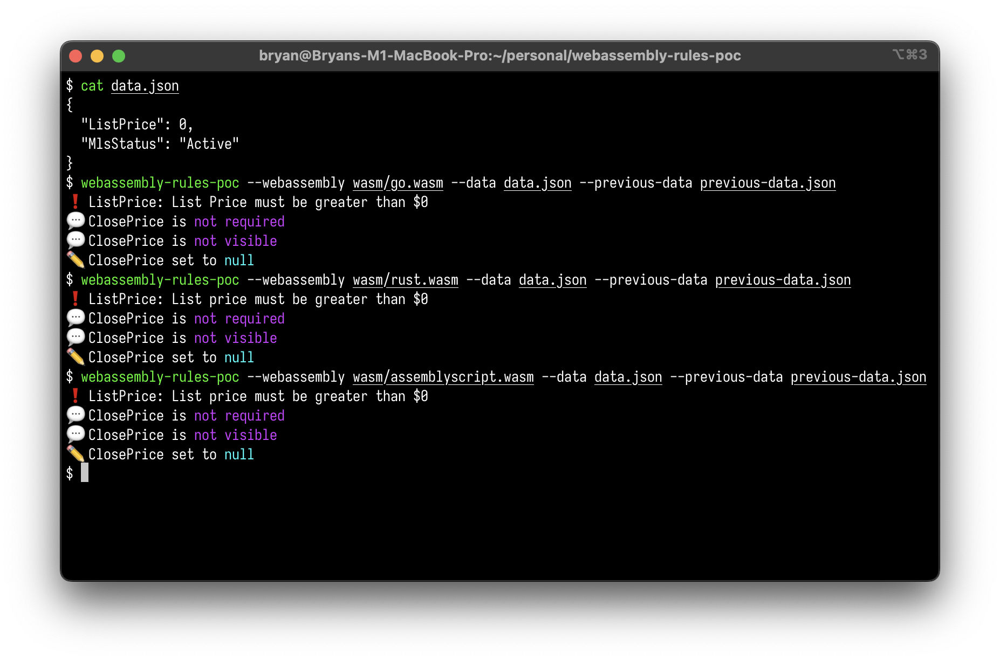

Proof-of-concept companion code to a proposal for evaluating business rules
using WebAssembly.

The proposal is here: https://github.com/RESOStandards/transport/discussions/92

## webassembly-rules-poc

A rust program that takes

- A WebAssembly file
- Current listing data
- Previous listing data (optional)

and runs the validation WebAssembly module, outputting the actions.

Build using `cargo`. See the command's `--help` for more information. Run with
the arguments `--webassembly <FILE> --data <FILE> --previous-data <FILE>`.

## wasm

Pre-compiled WebAssembly validation modules. These were built from the source in
`validators`, stripped, and copied here for easy access.

## validators

WebAssembly validation modules built in three different languages

- Go – using the [tinygo] compiler
- [AssemblyScript] – a TypeScript-like language intended for direct compilation
  to WebAssembly
- Rust

All three of these languages approximately implement the same example checks.

[tinygo]: https://tinygo.org/
[AssemblyScript]: https://www.assemblyscript.org/
